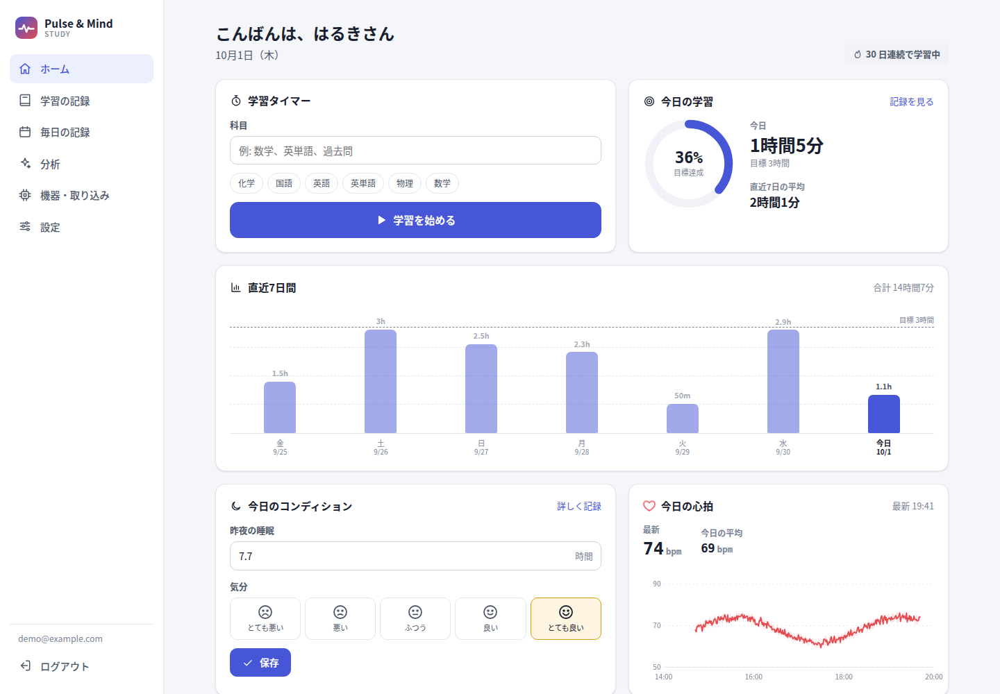
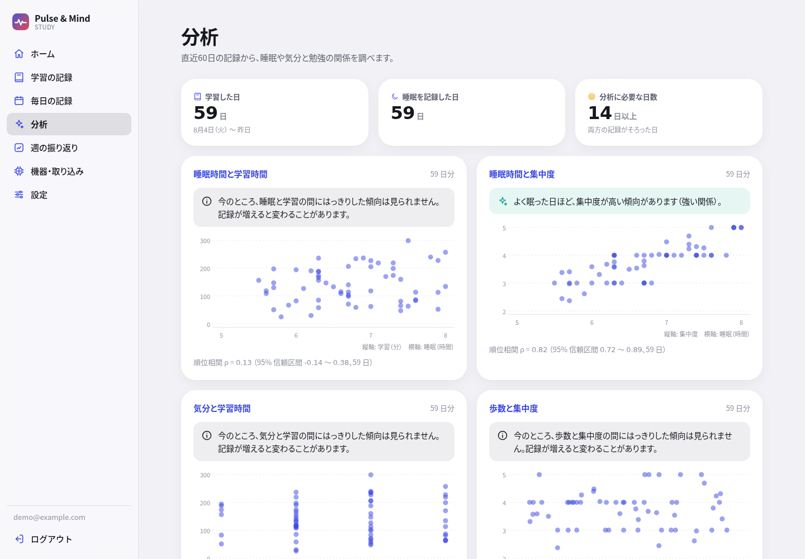
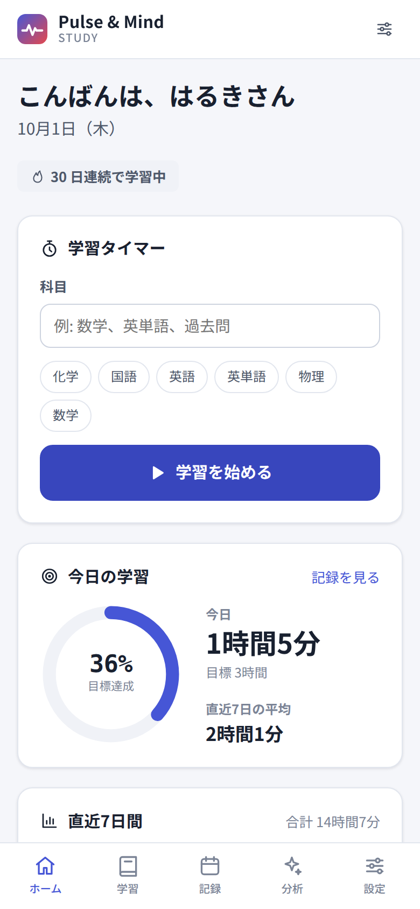
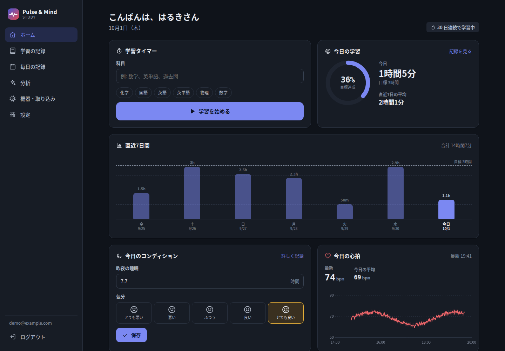
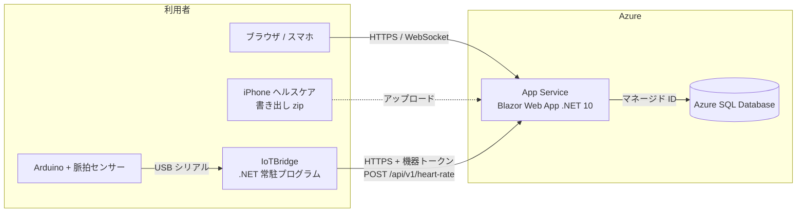

# Pulse & Mind Study

**勉強と体調を、ひとつのグラフで。** 受験生・大学生のための学習記録 Web アプリです。
学習時間に、睡眠・気分・心拍をいっしょに記録し、「よく眠れた日は集中できているか」を自分のデータで確かめられます。

[](https://github.com/haru-ki417/PulseMindStudy/actions/workflows/ci.yml)



| 分析 | スマートフォン | ダークモード |
|---|---|---|
|  |  |  |

> 画面の記録はすべて乱数で作った見本です。このアプリは医療機器ではありません。

## できること

| 機能 | 内容 |
|---|---|
| 学習タイマー | 科目を選んで開始・終了。終了時に集中度（1〜5）とメモを残せる。止め忘れは 12 時間で区切る |
| あとから入力 | 開始・終了時刻で記録。日付をまたぐ勉強や、時間帯の重なりも正しく扱う |
| 毎日の記録 | 睡眠時間・歩数・気分・メモを1日1回 |
| 心拍センサー | Arduino の脈拍センサー → PC の **IoTBridge** → 機器トークンで送信。1分ごとにまとめて保存 |
| iPhone / Apple Watch | 「ヘルスケア」の書き出し（zip）から心拍・歩数・睡眠を取り込む。何度取り込んでも重複しない |
| 分析 | 睡眠・気分・歩数と学習時間・集中度の関係を、順位相関と 95% 信頼区間で表示。時間帯ごとの集中度 |
| データの持ち出し・削除 | 全データを CSV（zip）で書き出し。アカウント削除で全記録を削除 |
| アカウント | メール + パスワード、2段階認証、パスキー。ログイン履歴（セキュリティの記録） |

## 設計で大事にしたこと

### 1. 分析は「言いすぎない」
元の試作では、5 行のダミーデータで学習させた機械学習モデルが「おすすめの学習時間」を出していました。
もっともらしい数字は出ますが、根拠がありません。作り直しでは次の方針にしました。

- **14 日分そろうまで結論を出さない**（それまでは「あと何日で分析できるか」を表示）
- 値そのものではなく**順位で比べる**（スピアマンの ρ）。5段階の気分や、極端に長く勉強した日があってもぶれにくい
- **95% 信頼区間が 0 をまたぐときは「はっきりした傾向は見られない」**と表示する
- 相関と因果を区別する説明を、結果のすぐ横に置く（「よく眠った日に長く勉強しているのは、休日だからかもしれない」）

### 2. 時刻と日付
- 時刻はすべて **UTC** で保存し、「何日に何分勉強したか」は**利用者のタイムゾーン**で区切る
  （日本時間 23:30〜0:45 の勉強は、2日に分けて 30 分 + 45 分と数える。夏時間のある地域もテスト済み）
- 心拍は1秒に何度も届くため、**1分ごとの平均・最小・最大・件数**だけを保存（件数があるので、あとから値が届いても平均を正しく更新できる）

### 3. 健康データを預かる責任
- 機器トークンは **SHA-256 のハッシュだけ**を保存し、平文は登録時に一度だけ表示
- アプリからデータベースへは **マネージド ID** で接続し、パスワードをどこにも置かない
- ログイン・登録の送信回数制限、パスワード 5 回失敗で 15 分ロック、CSP などの安全ヘッダー
- ヘルスケアの取り込みでは**必要な3種類だけ**を保存し、アップロードしたファイルはすぐ削除（XML の外部参照も無効化）
- セキュリティの記録の IP アドレスは**末尾を伏せて**保存し、180 日で自動削除
- 書き出す CSV は、表計算ソフトで**数式として実行されない**よう処理
- 氏名・電話番号など、機能に不要な個人情報は預からない

## 構成



| フォルダ | 内容 |
|---|---|
| `src/PulseMind.Core` | データ設計（EF Core）、学習・記録・心拍・機器・分析・書き出しの処理。画面に依存しない |
| `src/PulseMind.Web` | Blazor Web App（Interactive Server）、ASP.NET Core Identity、機器向け API |
| `src/PulseMind.IoTBridge` | Arduino のシリアル出力を読み、まとめて送る常駐プログラム（再接続・送り直し・見本モード） |
| `hardware/pulse-sensor` | Arduino のスケッチ（拍動の検出）と配線の説明 |
| `tests/PulseMind.Tests` | xUnit v3 のテスト（処理単体 + アプリ全体を起動しての API・安全性の確認） |
| `infra` | Azure の構成（Bicep） |

**使った技術**: C# / .NET 10, Blazor Web App, ASP.NET Core Identity（2段階認証・パスキー）, Entity Framework Core 10, SQL Server / Azure SQL Database, SQLite（テスト・動作確認）, xUnit v3, GitHub Actions, Bicep, Azure App Service, Arduino (C++)

グラフ（棒グラフ・心拍・散布図）とアイコン・ロゴは、外部のライブラリを使わずに HTML / CSS / SVG で自作しています。

## 動かし方

### Windows（Visual Studio / LocalDB）

```powershell
git clone https://github.com/haru-ki417/PulseMindStudy.git
cd PulseMindStudy
dotnet run --project src/PulseMind.Web
```

開発時は起動時にデータベース（LocalDB）が自動で作られます。ブラウザで表示されたアドレスを開き、新規登録してください。

### Mac / Linux（SQL Server なし）

SQLite で動かせます。見本のアカウントと30日分の見本データも作れます。

```bash
export Database__Provider=Sqlite
export ConnectionStrings__DefaultConnection="Data Source=pulsemind.db"
export Demo__Email=demo@example.com Demo__Password='Demo!2026pass'   # 任意: 見本データ（開発環境でだけ作られる）
dotnet run --project src/PulseMind.Web
```

### テスト

```bash
dotnet test --solution PulseMind.slnx
```

時刻の区切り（夏時間を含む）、学習の重なり・止め忘れ、心拍のまとめ方と重複の防止、ヘルスケアの読み取り（二重計上・睡眠の重なり・XXE）、
機器トークン、相関と信頼区間、アカウント削除で全データが消えること、書き出しに他人のデータやトークンが混ざらないこと、
API の認証、安全ヘッダー、ログインの回数制限などを確かめています。

### 心拍センサー

[hardware/pulse-sensor/README.md](hardware/pulse-sensor/README.md) を見てください。センサーが無くても、見本の心拍を送って試せます。

```bash
PULSEMIND_DEVICE_TOKEN=pmd_... dotnet run --project src/PulseMind.IoTBridge -- --Bridge:Simulate=true --Bridge:ServerUrl=https://localhost:7238
```

### Azure に公開する

[docs/deploy.md](docs/deploy.md) を見てください（Bicep で App Service と Azure SQL Database の無料枠を作り、GitHub Actions から OIDC で配置します）。

## 機器向け API

```http
POST /api/v1/heart-rate
Authorization: Bearer pmd_xxxxxxxx
Content-Type: application/json

{ "samples": [ { "t": "2026-10-01T21:00:05+09:00", "bpm": 72 } ] }
```

- 1回 2,000 件まで、本文 512KB まで、送信元の IP アドレスごとに 1 分 120 回まで
- 30〜220 bpm の範囲外、未来（5 分以上先）の時刻は捨てて件数を返す
- `GET /api/v1/ping` でトークンの確認ができる

## ライセンス

[MIT License](LICENSE)

> Pulse & Mind Study は医療機器ではなく、病気の診断・治療・予防を目的としたものではありません。
